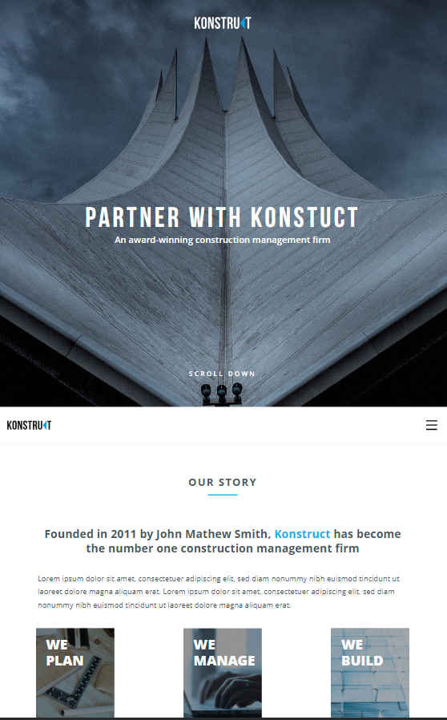
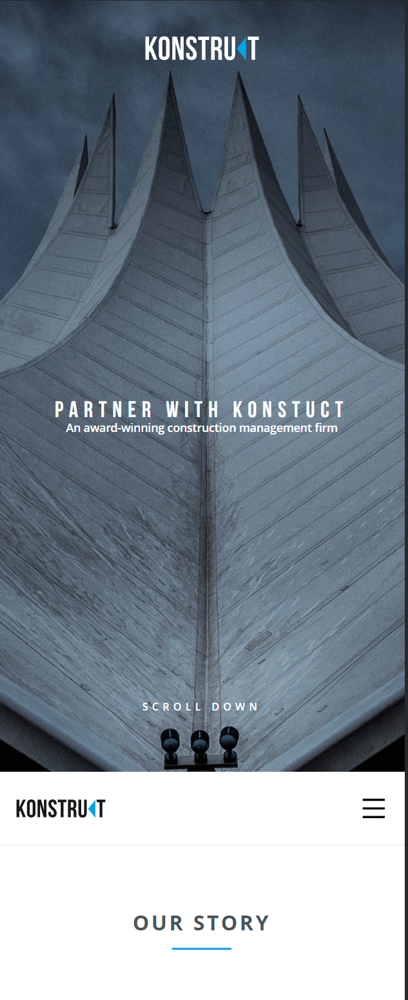

# construct-react-app  

Одностраничный лендинг. 

* [Ссылка на макет в Figma](https://www.figma.com/file/zR1XfguUZ5wWWOy6ah30Xq/konstruct-template?mode=dev)

* [Приложение](https://construct-react-app.vercel.app/)  

**В проекте реализованы возможности:**

* Авто-скролл для перемещения по странице
* Проверка корректности введённого email

#  

Для скролла использовался react-scroll.  

Для бургер меню использовалась библиотека React, а также CSS modules.   

Для слайдера использовался Swiper.  

## Запуск проекта  

`npm i` — установить все зависимости   
`npm run start` — запускает сервер   
`npm run build` — запуск проекта в режиме продакшн, с формированием файлов подготовленных к деплою в директории /build 

#  

Десктоп:

Планшет:

Мобильный:

